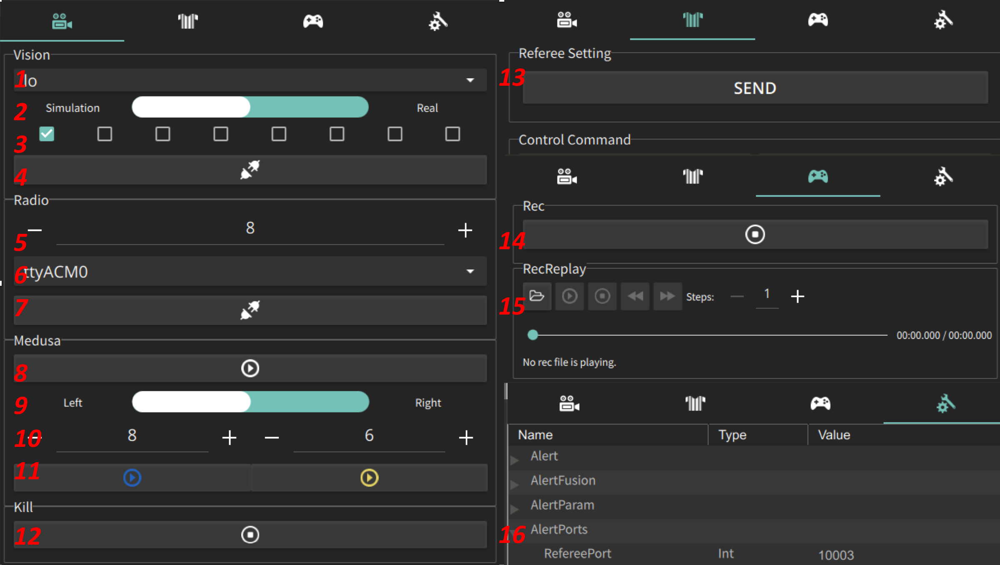

# Client使用说明

> 本篇文档主要说明Client软件界面以及快捷键等相关操作
>
> 请确保已经了解了[SSL比赛](https://github.com/ZJUSSL/TeamDescription)以及[rocos软件流程](rocos_comm)

## 软件界面

在编译过后打开Client可以看到以上界面，左侧为主画布，主要实时显示图像信息，包括机器人信息以及蓝黄两队的调试信息，调试信息在运行AI程序后可以看到；右侧为操作栏，四栏分别为主操作栏、裁判盒、LOG回放和参数设置。

接下来将针对四栏目的关键按钮功能进行说明：

### 主操作栏

通信栏主要包含了所有与通信相关的按钮，包括接收图像、连接发射机、运行AI程序（双边对打）以及一个快速结束任务的按钮。

* **➀ - ➃** 图像控制 : ④是接收图像的连接按钮，若②选择的是仿真，则会同时启动一个仿真。③是具体接收图像的摄像头控制，最多支持接收八个摄像头，目前国际规则中2018年采用的8DC1394 CAM \* 8 是目前已知的最多摄像头个数，2018年的国际赛场地大小为9x12m。③的某一个打钩记为需要接收该ID摄像头的图像才进行图像合并。①为运行实际机器人时需要关注的网关，一台电脑经常会有若干个网关，例如无线、有线、虚拟机自建网关。若忽略网关设置则可能无法接收到图像，由于涉及到UDP组播的网络通讯知识，可自行了解。
* **➄ - ➆** 发射机控制 : 目前的发射机通过串口连接电脑，安装CP210x驱动后，若电脑可以正常识别，会在⑥的下拉菜单中显示该发射机的串口名称，使用⑤设置需要配置的频点，并点击⑦发送频点信息。值得注意的是，由于当前发射机的串口通信机制，运行实物程序的时候，需要保持⑦为连接状态。
* **➇ - ⑪** 主程序控制 : ⑨为设置⑪中蓝方的进攻方向，而⑪中黄方进攻方向为⑨的反值，即在仿真中同时运行两边代码时，不需要配置⑨，只需要直接点击⑪的两按钮即可。➉目前未使用，是为网口发射机预留的配置接口。➇为守护进程，目前版本rocos未使用该按钮。
* ⑫ Kill : 点击该按钮将以killtask的方式停止全部程序，包括Client、Sim以及Medusa
  * 该按钮调用的命令：ubuntu-pkill,windows-taskkill

### 裁判盒

用于快速测试程序，点击⑬按钮即可发送裁判盒指令，具体指令含义请参考[官方规则](https://ssl.robocup.org/rules/)

### 日志回放

* 按钮⑭控制了是否录制日志，默认开启。日志将记录如下信息：原始图像、滤波图像、全部调试信息。
* ⑮用于日志回放，需要注意的是，在日志回放时，请将按钮➃保持断开状态。

### 参数配置

> ☛ **在修改参数的时候，记得按`Enter`键 使修改生效**

灵活使用参数配置功能可以有效的设置出更灵活的程序，你或许可以使用这一栏完成以下功能：

* 快速的针对Client显示栏的场地长宽的参数进行设置，灵活适应不同大小场地
* 快速控制Medusa的不同功能的调试信息的输出（若保持全部输出可能绘制信息会十分混乱且影响运行效率）
* 灵活定义参数，控制机器人运动参数（速度，加速加速度，减速加速度，不同角色分开配置）
* 配置网络通信的默认端口，例如接收图像信息、接收裁判盒信息等端口

在Client中，支持以下参数：

* String
* Integer
* Double Float
* Boolean

## 快捷操作

>  包括快捷键以及一些非按钮操作

* 在仿真状态下，使用`数字键`，或者`ctrl+数字键`可以分别设置蓝黄两方机器人数量
* 通过`鼠标左键`点击可以快速设置球的位置
* 通过`鼠标左键`可以拖拽机器人到指定位置
* 通过`鼠标右键`可以设置某个机器人的朝向，或设置一个带初速度的球
* 按住`ctrl/alt`再进行`鼠标左键`框选，可以实现蓝/黄方多个机器人选择，方便一次移动多个机器人，被选中机器人会显示边框，若想取消选择，按住ctrl/alt后鼠标点击空白区域即可
* 使用`鼠标滚轮`可以进行界面的缩放，按住滚轮可以进行缩放情况下的拖拽

---

> © Author : [Mark Huang](https://github.com/ZJUMark) - ZJUNlict Team
>
> ✉ Contact : [zjunlict.ssl@gmail.com](mailto:zjunlict.ssl@gmail.com)

